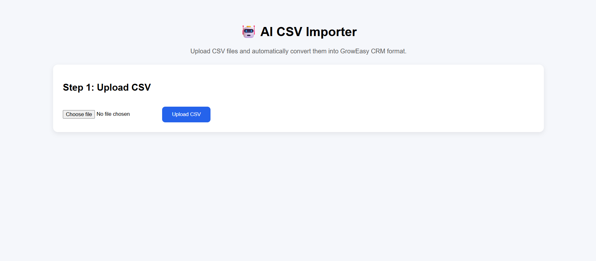
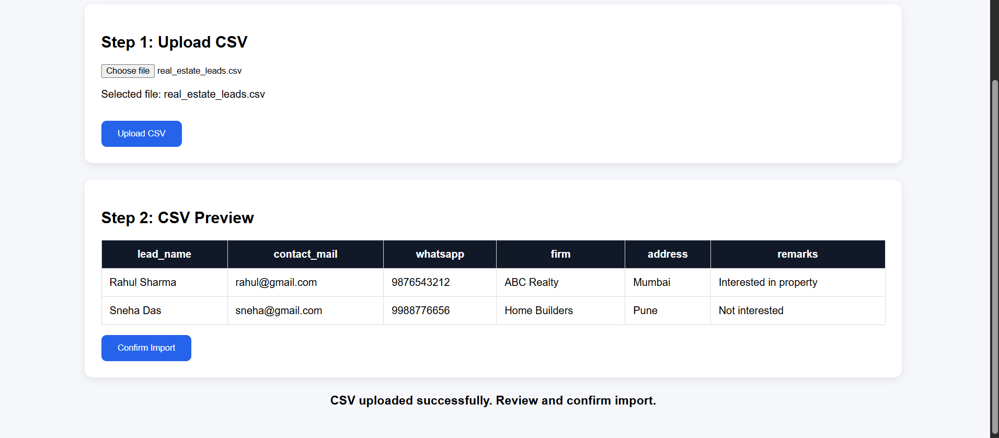
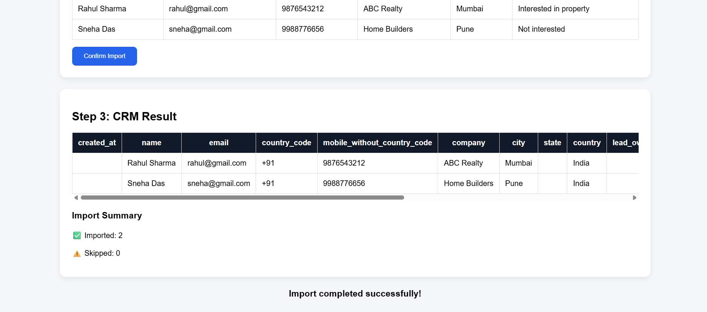

# 🤖 AI-Powered CSV Importer

An AI-powered CSV Importer that intelligently converts CSV files from different sources into a standardized GrowEasy CRM format using **Gemini AI**.

---

## 🌐 Live Demo

### Frontend
https://groweasy-csv-importer-mv69.vercel.app

### Backend
https://groweasy-backend-wpmu.onrender.com

---

## 📂 GitHub Repository

https://github.com/Nithikrishna/groweasy-csv-importer

---

# ✨ Features

- 📤 Upload CSV files
- 📄 Preview uploaded CSV
- 🤖 AI-powered CRM field extraction using Gemini AI
- 🔄 Automatically map different CSV column names
- 📊 Display standardized CRM records
- 📈 Import summary (Imported / Skipped)
- ☁️ Fully deployed using Vercel and Render

---

# 🛠 Tech Stack

### Frontend
- Next.js
- React
- TypeScript
- CSS

### Backend
- Node.js
- Express.js
- Multer
- csv-parser

### AI
- Google Gemini API

### Deployment
- Vercel
- Render

### Version Control
- Git
- GitHub

---

# 🏗 Project Architecture

```
CSV File
    │
    ▼
Next.js Frontend
    │
POST /upload
    ▼
Express Backend
    │
CSV Parsing
    │
    ▼
Gemini AI
    │
CRM JSON
    │
    ▼
Display Results
```

---

# 🤖 AI Prompt Strategy

The application uses Gemini AI to intelligently identify different CSV column names and convert them into a standardized CRM schema.

Examples:

| CSV Column | CRM Field |
|------------|-----------|
| customer_name | name |
| email_address | email |
| phone_number | mobile |
| business_name | company |
| location | city |
| role | description |

The AI can process CSV files from multiple sources without requiring a fixed column format.

---

# 📸 Screenshots

## Home Page



---

## CSV Preview



---

## CRM Result



---

# 🚀 Installation

Clone the repository

```bash
git clone https://github.com/Nithikrishna/groweasy-csv-importer.git
```

Install frontend

```bash
npm install
```

Install backend

```bash
cd backend
npm install
```

Create a `.env` file inside the backend folder

```env
GEMINI_API_KEY=YOUR_API_KEY
```

Run backend

```bash
node server.js
```

Run frontend

```bash
npm run dev
```

---

# 📁 Project Structure

```
groweasy-csv-importer/

├── backend/
│   ├── services/
│   │     aiService.js
│   ├── server.js
│   └── package.json
│
├── public/
│   └── screenshots/
│
├── src/
│   └── app/
│       ├── page.tsx
│       └── globals.css
│
├── package.json
└── README.md
```

---

# 📊 Workflow

1. Upload CSV
2. Parse CSV
3. Preview Data
4. Send records to Gemini AI
5. AI extracts CRM fields
6. Display standardized CRM records
7. Show import statistics

---

# 🔮 Future Improvements

- Drag & Drop CSV Upload
- Download CRM CSV
- Better Lead Validation
- Dark Mode
- Authentication
- Database Integration
- Search & Filter
- Pagination

---

# 👩‍💻 Developed By

**Nithi Krishna**

B.Tech Robotics & Artificial Intelligence

Rajiv Gandhi Institute of Technology, Kottayam

---

⭐ If you found this project useful, consider giving it a star!